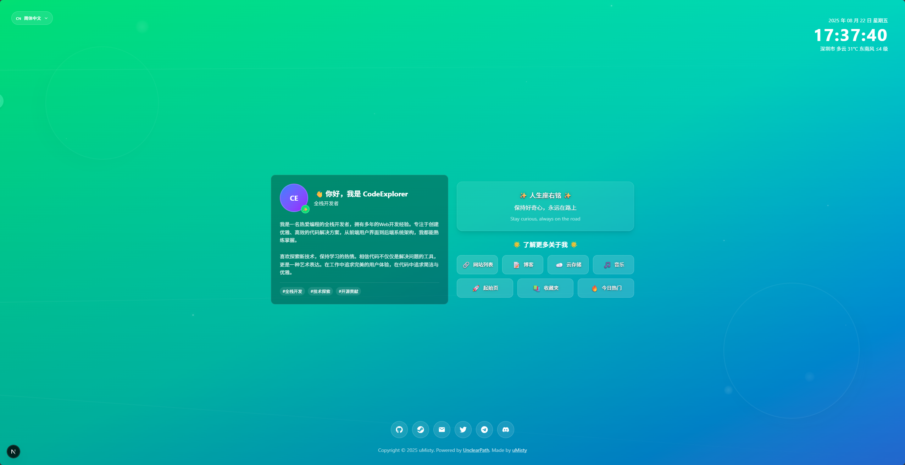

# UnclearPath ✨


> 一个优雅的个人主页，展示你的数字名片

[](https://nextjs.org/)
[](https://www.typescriptlang.org/)
[](https://tailwindcss.com/)

## 🌟 项目背景

基于 [imsyy/home](https://github.com/imsyy/home) 的设计灵感，使用AI辅助开发完成的个人主页项目。采用现代前端技术栈，提供优雅的用户体验和完整的多语言支持。

## ✨ 功能特性

### 🎨 界面设计
- **动态渐变背景** - 和谐色彩组合与流体动画效果
- **响应式布局** - 完美适配桌面端和移动端
- **玻璃态设计** - 现代化的毛玻璃效果

### 🌤️ 实时天气
- **智能定位** - 自动获取用户位置并缓存，减少API调用
- **多语言天气** - 支持中英文天气状况显示
- **降级处理** - API不可用时使用Mock数据
- **详细信息** - 温度、风向、风力等完整气象数据

### 🕐 动态时钟
- **实时更新** - 精确到秒的时间显示
- **多语言格式** - 根据语言自适应日期格式

### 🌍 多语言支持
- **三语言切换** - 简体中文、繁体中文、English
- **智能检测** - 自动识别浏览器语言偏好
- **持久化存储** - 记住用户语言选择

### 📱 社交与导航
- **社交链接** - GitHub、邮箱等平台链接
- **快捷导航** - 个人项目和常用工具入口

## 📸 项目截图



*项目主界面展示 - 动态背景、实时时钟、天气信息、多语言切换*

## 🚀 快速开始

### 环境要求
- Node.js 18+
- pnpm 8+ (推荐)

### 安装与运行
```bash
# 克隆项目
git clone https://github.com/uMisty/UnclearPath.git
cd UnclearPath

# 安装依赖
pnpm install

# 开发模式
pnpm dev

# 构建项目
pnpm build

# 启动生产环境
pnpm start
```

访问 [http://localhost:3000](http://localhost:3000) 查看效果。

## ⚙️ 配置说明

### 环境变量
创建 `.env.local` 文件配置天气API（可选）：
```env
VISUAL_CROSSING_API_KEY=your_api_key_here
```

> 💡 不配置API Key时，项目会使用Mock数据显示天气信息

### 天气API申请
1. 访问 [Visual Crossing Weather](https://www.visualcrossing.com/weather-api)
2. 注册免费账户（每天1000次调用额度）
3. 在Account页面获取API Key
4. 配置到 `.env.local` 文件

### 个人信息自定义
在 `src/i18n/locales/` 目录下的语言文件中修改：

```typescript
// 站点信息
site: {
  title: '个人主页',
  name: 'uMisty',
  description: '你的网站描述',
},

// 个人介绍
introduction: {
  greeting: '👋 你好，我是 YourName',
  role: '你的职业',
  bio: '你的个人简介...',
},
```

在 `src/app/page.tsx` 中修改社交链接：
```typescript
const socialLinks = [
  { icon: FaGithub, href: 'https://github.com/yourusername', label: 'GitHub' },
  { icon: MdEmail, href: 'mailto:your@email.com', label: 'Email' },
  // ... 更多链接
];
```

## 🛠️ 技术栈

- **框架**: Next.js 15.5.0 (App Router + Turbopack)
- **语言**: TypeScript ^5
- **样式**: Tailwind CSS ^4
- **图标**: React Icons 5.5.0
- **代码质量**: Biome 2.2.0
- **部署**: Vercel / Netlify / 自托管

## 📦 项目结构

```
UnclearPath/
├── src/
│   ├── app/                    # Next.js App Router
│   │   ├── api/weather/        # 天气API路由
│   │   ├── globals.css         # 全局样式
│   │   ├── layout.tsx          # 根布局
│   │   └── page.tsx            # 主页面
│   ├── components/             # 组件目录
│   │   └── AnimatedBackground.tsx  # 动态背景组件
│   ├── i18n/                   # 国际化
│   │   ├── locales/            # 分语言文件
│   │   │   ├── zh.ts           # 简体中文
│   │   │   ├── zh-TW.ts        # 繁体中文
│   │   │   └── en.ts           # 英文
│   │   ├── LanguageContext.tsx # 语言上下文
│   │   ├── LanguageSwitch.tsx  # 语言切换器
│   │   └── translations.ts     # 翻译聚合器
│   └── utils/                  # 工具函数
│       └── weatherCache.ts     # 天气缓存
├── public/                     # 静态资源
│   ├── logo.png               # 项目Logo
│   ├── demo.png               # 项目截图
│   └── favicon.ico            # 网站图标
├── Dockerfile                 # Docker构建文件
├── docker-compose.yml         # Docker编排文件
├── .dockerignore              # Docker忽略文件
├── DOCKER.md                  # Docker部署详细指南
├── package.json
└── README.md
```

## 🎯 部署指南

### Vercel 部署 (推荐)
1. Fork 本项目到你的 GitHub
2. 在 [Vercel](https://vercel.com) 中导入项目
3. 配置环境变量: `VISUAL_CROSSING_API_KEY=your_api_key`
4. 部署完成！

### Netlify 部署
1. 在 [Netlify](https://netlify.com) 中连接 GitHub 仓库
2. 构建命令: `pnpm build`
3. 发布目录: `.next`
4. 配置环境变量并部署

### 自托管部署

#### 传统方式
```bash
# 构建项目
pnpm build

# 使用 PM2 运行
pm2 start npm --name "unclearpath" -- start
```

#### Docker 部署

**快速启动（推荐）:**
```bash
# 使用docker-compose
docker-compose up -d

# 查看日志
docker-compose logs -f
```

**手动构建:**
```bash
# 构建Docker镜像
docker build -t unclearpath .

# 运行容器
docker run -d \
  --name unclearpath \
  -p 3000:3000 \
  -e VISUAL_CROSSING_API_KEY=your_api_key_here \
  unclearpath
```

#### Docker 部署说明
- **镜像优化**: 使用多阶段构建和Next.js standalone输出，最小化镜像大小
- **安全性**: 使用非root用户运行应用
- **环境变量**: 通过 `-e` 参数或docker-compose配置API Key
- **健康检查**: 自动监控容器健康状态
- **持久化**: 容器重启后自动恢复运行

## ❓ 常见问题

**Q: 天气信息显示不准确怎么办？**
A: 检查API Key配置、浏览器地理位置权限，或查看控制台错误信息。

**Q: 如何自定义个人信息？**
A: 修改 `src/i18n/locales/` 目录下的语言文件和 `src/app/page.tsx` 中的社交链接。

**Q: 支持哪些地区的天气？**
A: Visual Crossing API支持全球天气数据，包括中国大陆、港澳台等地区。

**Q: 如何更换背景动画效果？**
A: 在 `src/components/AnimatedBackground.tsx` 中调整动画参数，或在 `src/app/globals.css` 中修改CSS动画。

## 🤝 贡献指南

欢迎提交 Issues 和 Pull Requests！

1. Fork 本项目
2. 创建特性分支 (`git checkout -b feature/AmazingFeature`)
3. 提交更改 (`git commit -m 'Add some AmazingFeature'`)
4. 推送到分支 (`git push origin feature/AmazingFeature`)
5. 打开 Pull Request

## 📄 开源协议

本项目采用 [MIT](LICENSE) 协议开源。

## 🙏 致谢

- [imsyy/home](https://github.com/imsyy/home) - 设计灵感来源
- [Next.js](https://nextjs.org/) - React全栈框架
- [Visual Crossing Weather](https://www.visualcrossing.com/) - 天气数据API
- [Tailwind CSS](https://tailwindcss.com/) - 实用CSS框架
- [React Icons](https://react-icons.github.io/react-icons/) - 图标库

---

**Made with ❤️ by [uMisty](https://github.com/uMisty)**